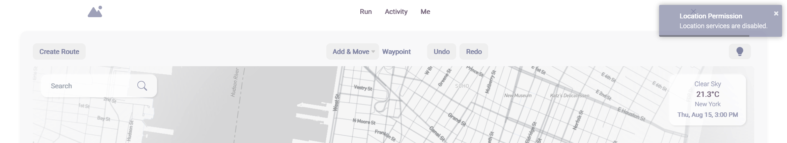
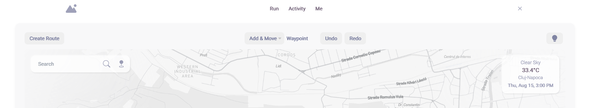
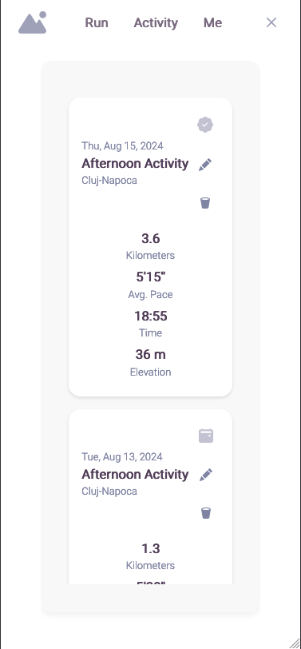

# Peak

The application aims to develop a platform that enhances athlete performance during running and jogging sessions. It is designed to optimise route planning and help identify safe routes for physical activities. By integrating features such as personalised recommendations based on route data, performance indicators, body measurements, and weather conditions, users can more easily achieve their set performance goals. Additionally, the platform allows users to manage routes and tag activities, providing an effective tool for monitoring and managing physical effort.


## Core Features
### 1. Route planning and management
### 2. Route comparison using GPX files
### 3. Personalised performance recommendations based on route, weather, and user data
### 4. Real-time weather data integration
### 5. Activity tagging and history tracking


## Technologies

- **Frontend Technologies**: 
  - ```JavaScript Vanilla```
  - ```HTML``` & ```CSS```
- **Backend Technologies**: 
  - ```Java```
  - ```Spring Boot```, ```Spring Security```, ```Spring Data```
  - ```Hibernate```
  - ```Java Persistence API (JPA)```
  - ```JSON Web Tokens (JWT)```
- **Database**: 
  - ```Microsoft SQL Server```
- **Tools**: 
  - ```Docker``` for containerisation of DB
  - ```Postman``` for testing APIs
  - ```Vite``` for client-side builds


## Architecture
The application integrates a combination of architectural models to enable efficient communication between its various components.

### Client-Server Architecture

### Layered Architecture

### Microservices Architecture


The application implements a suite of microservices, each responsible for specific functionalities within the system.

#### 1. Authentication:
- ```User Authentication```: Manages visitor registration, user login, and authentication using JSON Web Tokens (JWT).
- ```Request Routing```: Acts as a gateway for the microservices suite, routing incoming requests to the appropriate services.
- ```Security```: Implements JWT-based security to authorise requests received from the client, ensuring that only authenticated users can access protected resources.

#### 2. Users: 
- ```User Management```: Handles the creation, retrieval, updating, and deletion of user records.
- ```Data Protection```: Converts Person objects into Data Transfer Objects (DTOs) to protect sensitive information by excluding certain attributes during communication with other microservices.
- ```Inter-Microservice Communication```: Provides user data to other microservices, facilitating authentication and personalising the user experience.

#### 3. Routes: 
- ```Route Management```: Handles the creation, retrieval, updating, and deletion of route records.
- ```Route Import```: Allows users to import and extract routes from GPX files.
- ```Geographic and Weather Data Integration```: Combines geographic data with weather information to enhance route planning.

#### 4. Maps: 
- ```External Map Services Management```: Interacts with external APIs, such as Mapbox and Google Maps, to retrieve map-related data, including directions, elevation, and location suggestions.
- ```Route Comparison```: Allows comparison of saved routes in the database with imported routes to identify the degree of similarity.

#### 5. Weather: 
- ```Current Weather Conditions```: Retrieves real-time weather information from the OpenWeather provider based on latitude and longitude.
- ```Weather Forecasts```: Provides weather data in three-hour intervals for a specified location, with forecasts available for up to seven days.

#### 6. Assistant: 
- ```Customised Recommendations```: Generates content tailored to the user’s context and planned route.
- ```AI Integration```: Interacts with the GPT-4 Turbo model provided by OpenAI to enhance the recommendation process.
- ```Route and User Data Integration```: Utilises classes imported from other microservices while ensuring data security by excluding sensitive user information.


## Use Cases & Roles

### Visitors (Unregistered Users)
- ```Home Page Access```: Visitors can access the home page, which displays the authentication form.
- ```Account Creation```: Visitors have access to the account creation page, where they can sign up for an account.


### Registered Users (Clients/Athletes)
- ```Authentication```: Users can log in using a username and password.
- ```Personal Information Management```: Users can view and edit their personal details, including body measurements and training frequency.
- ```Route Management```: Users can create, view, edit, and compare planned routes with those already uploaded on the platform to observe deviations from the planned route or the degree of similarity between routes.
- ```Activity Planning```: Users can plan activities and view relevant information, such as forecasted weather parameters for the chosen time and date.
- ```Personalised Recommendations```: Users receive personalised recommendations generated by a large language model (LLM), including strategies for managing physical effort, hydration, and nutritional preparation before training.


## ER Diagram


## Client Application Overview

### Project Tree:
- **JavaScript (JS) Script** – `main.js`: Handles the initial page setup based on the accessed URL and user session (authenticated or not). It manages navigation between pages by updating content (partially or fully), initialises components, and sets event listeners.
- **HTML File** – `index.html`: Defines the basic structure for each section of the application. It contains paths to external dependencies like CSS files, libraries, fonts, modules, and scripts. It also includes the navigation bar and enables navigation between sections without reloading all resources, improving performance.
- **CSS File** – `styles.css`: Manages the styling of HTML elements, with a focus on responsive design. Media queries are used to adjust the layout and style according to the screen width and height, ensuring compatibility with both mobile and desktop devices.
- **Configuration Module** – `config/`: Stores configuration files and centralises API endpoint URLs in a single file to ensure consistency when making requests and handling data transfer.
- **Constants Module** – `const/`: Contains constants and enumerations used throughout the application, such as map waypoint editing states, location permissions, and the user’s current location.
- **DTO Module** – `dto/`: Contains Data Transfer Object (DTO) classes that mirror Java classes from the backend and are used for validating and exchanging data between the client and server.
- **API Module** – `api/`: Contains the logic for functions that interact with the backend, organised by microservices. Native JavaScript `fetch` is used for data retrieval and implementing create, update, and delete operations on resources.
- **Assets Module** – `assets/`: Contains static resources such as images, fonts, and other files required by the client-side application.
- **Components and Utilities**: Manages the application through `Managers` and `EventBus`, dynamically creates HTML elements through `innerHTML`, and provides auxiliary functions.
  - **Managers**: Base classes responsible for managing state and operations like defining routes, placing waypoints on the map, undo/redo actions, altitude, and weather metrics.
  - **EventBus**: Implements a publish-subscribe pattern to facilitate communication between different parts of the application.
  - **UI Components**: Functions that generate visual elements such as maps, cards, dashboards, widgets, and buttons. These components are created dynamically using a combination of `innerHTML` and programmatic manipulation of the Document Object Model (DOM), ensuring that logic is kept separate from UI rendering.

## Functionalities

### A. Authentication & Registration Pages

#### User Registration
Visitors are presented with the authentication form, which also includes an “I don’t have an account” button. By clicking this, unregistered visitors can access the account creation form, which requires essential details such as name, username, password, date of birth, gender, weight, height, and weekly training frequency. If all fields are correctly completed, a message will be displayed: “Joined! You will be redirected shortly,” and the newly registered user will be redirected to the main screen.


#### User Login
Once registered, users can log into their accounts using their username and password. If incorrect details are entered, the application will display the appropriate error message. Upon successful login, the user will be redirected to the “Run” page.


### B. Dashboard
Upon being redirected to the main screen displayed on the “Run” page, users have access to features such as search and automatic location, route drawing, and planning. Additional tools include weather condition checks and personalised suggestions.

#### Search and Location
Users can search for specific locations on the map to start their routes from various points globally. 


The application also offers automatic location detection using the browser’s location services, helping pinpoint the precise geographic location of the device. If location services are enabled, the map will display the current location. If disabled, the map will show a generic location, and the location button will be deactivated. Users can still navigate the map manually.




#### Route Drawing
The dashboard allows users to create new routes by placing waypoints on the map. Users can dynamically adjust the points by moving, duplicating, or deleting them while viewing the projected route. Additionally, the dashboard displays real-time metrics such as distance, duration, and altitude, allowing users to adjust their running pace, with performance metrics updating accordingly. Units adjust automatically based on the distance (meters/kilometers), and time is displayed in minutes or hours as necessary.


#### Weather Conditions and Planning
Athletes can select the desired day and time for their activity while sorting weather conditions, helping them choose the best scenario for their run. The provided weather data includes essential details such as temperature, “feels like” temperature, humidity, pressure, wind speed, cloud cover, and a descriptive summary of the conditions.


#### Intelligent Assistant and Performance Suggestions
Before starting an activity, users can request personalised suggestions for their planned activity. These tips are generated based on current weather conditions, route data, and the athlete’s body metrics. The suggestions cover pacing strategy, effort management, hydration, and nutritional preparation. Once users access this feature, they receive a notification asking them to wait while suggestions are generated via an external API. The information is then displayed in a dedicated window in a clear and readable format, helping users optimise their performance.


### C. Activity Log and Route Management
By accessing the “Activity” page from the navigation bar, users can view their activity history, sorted chronologically by storage date. Each activity card displays key parameters like distance, pace, time, and altitude, providing users with a quick overview of the goals set for that route.


#### Peek Feature
Selecting any activity from the list allows users to quickly view a more detailed summary, including the planned or completed route on a map, expected weather conditions, and other relevant statistics. The “peek” feature adapts depending on whether the activity is scheduled or completed, displaying contextually relevant information. For scheduled routes, it shows forecasted weather parameters, while for completed routes, it offers a percentage similarity score comparing the completed route to the planned one and overlays the loaded route on the map. Dynamic adaptability ensures users receive pertinent information, helping them clearly label activities in the log.


#### Editing and Uploading GPX Files
By clicking the “Edit” button, represented by a pencil icon, users are redirected to the route editing page. Once the saved route is displayed on the map, waypoints can be modified, and users can change the activity date based on new weather forecasts. The import menu at the bottom of the page allows users to upload completed activities stored as GPX files.


#### Comparing Planned and Uploaded Routes
After processing the file, the two routes will be displayed on the map alongside a heatmap highlighting deviations from the planned route. When zooming beyond a certain threshold, the heatmap disappears to simplify viewing, and when the routes are distant, the heatmap reappears, providing an overview of the deviations. A percentage similarity score will also be displayed at the bottom of the dashboard, helping users assess their overall performance during the activity.


### D. Profile Page
From the navigation bar, users can also access their profile page, where they can control the information shared with the platform. Users can modify personal details such as name, surname, and date of birth, update their athlete profile, change their password, or even delete their account.


### E. User Interface and Interaction

#### Minimalist and Intuitive Design
Throughout their interaction with the system, users are presented with a minimalist interface designed to maximize the utility of each element. Features are easily accessible and displayed centrally on the screen as a menu bar or widgets, without the need for scrolling.

#### Interactive Map
The map allows users to zoom, move around, and place waypoints accurately. Users can tilt the map, offering a 3D view of the terrain, buildings, and points of interest. The Mapbox map is customized to align with the application’s color palette, maintaining design consistency.

#### Responsive UI Elements
The user is presented with a fully responsive interface, where visual elements and text are resized based on the screen size of the device in use.





Element positioning is dynamically restructured to accommodate relevant information. For example, in portrait mode on tablets, the “peek” feature is disabled to allow space for the activity cards and their details. Additionally, a contextual message is displayed when users attempt to view the map vertically on a mobile device, encouraging them to use landscape orientation for an optimal experience.


